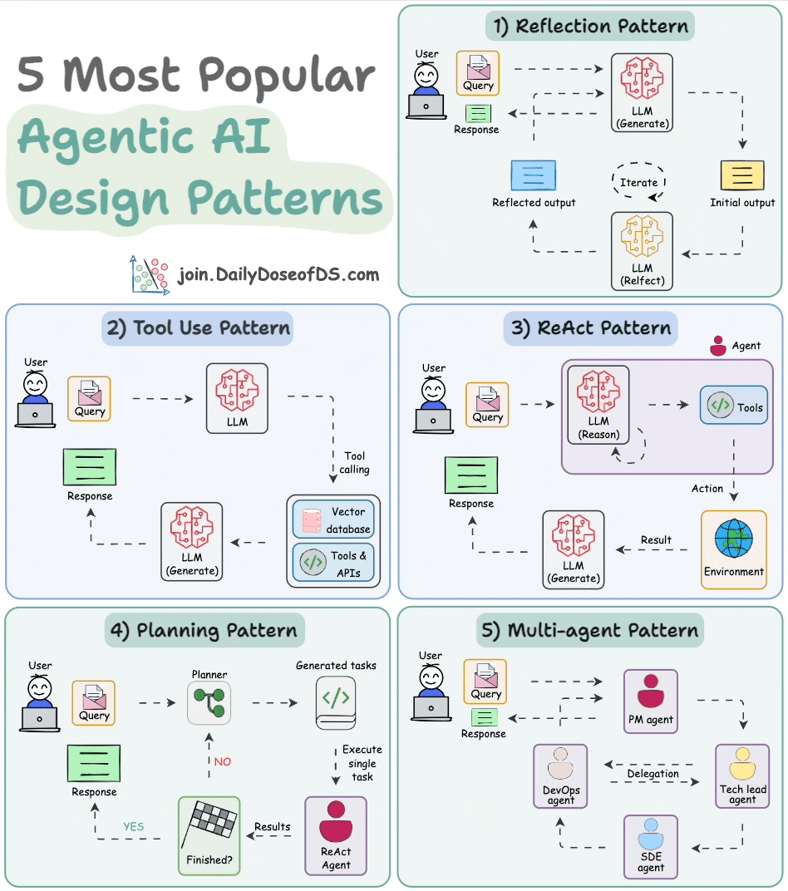
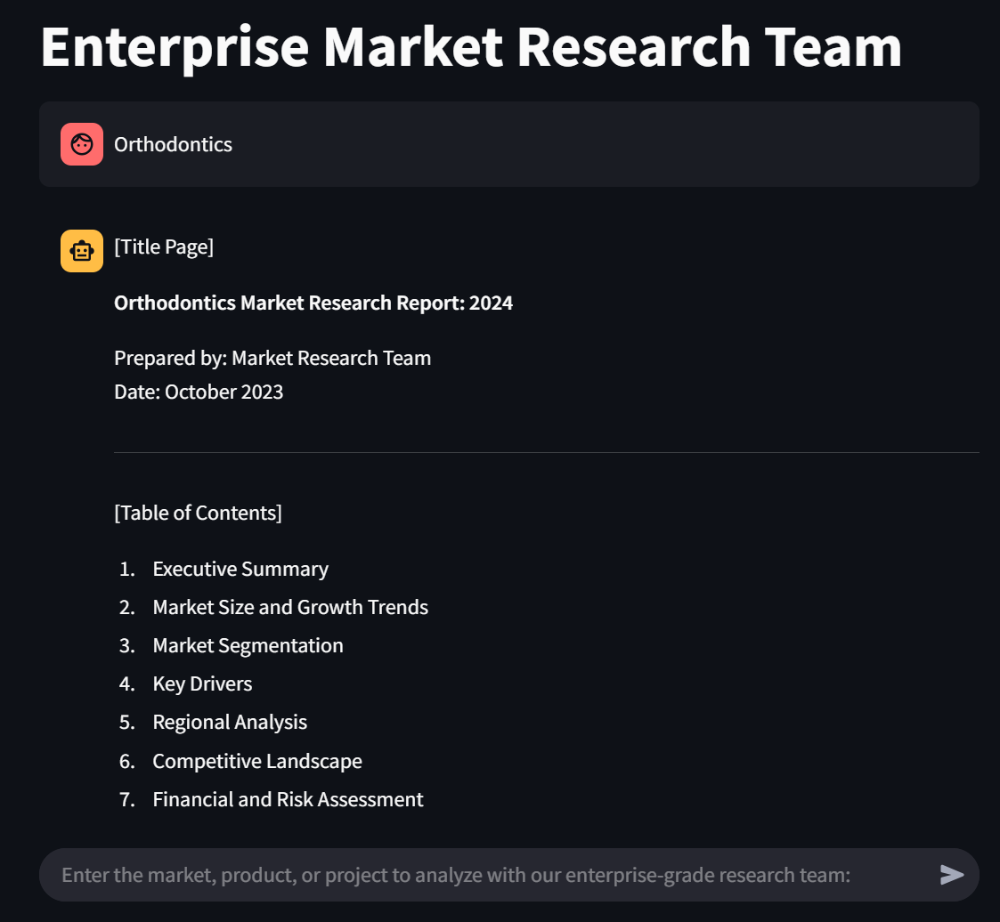
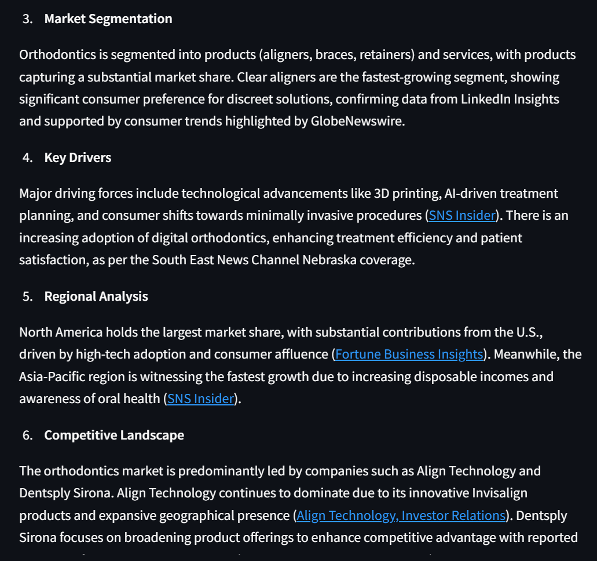
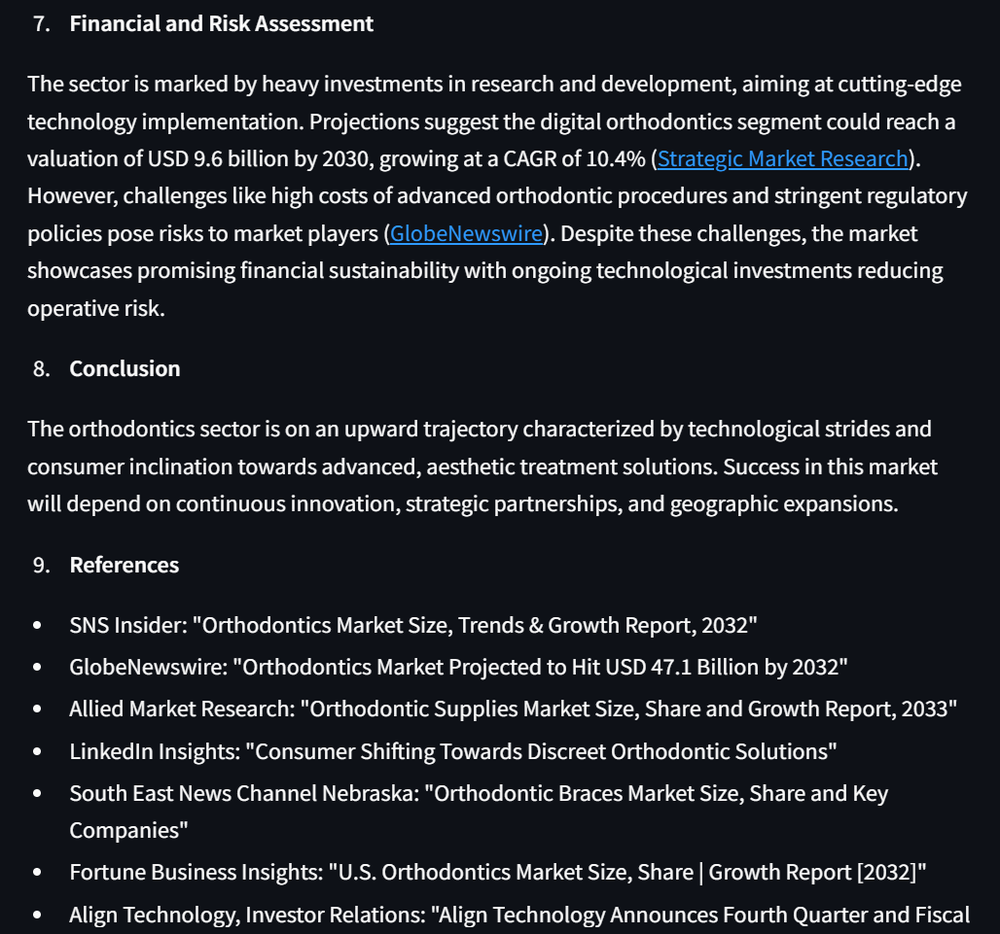

# 🤖 **Conversational Chatbots**

AI Chatbot systems can be designed in many different architectures based on user needs and scenario adapatation.

In this section of the page, I tried to create a traditional RAG Based document retriever conversational chatbot, a Hierarchical Mult-agent chatbot, and a RAG-Webscraping fall back mechanism chatbot.
---

## 🚀 **Hierarchical Agents - Digital Market Research Team**  
 

Utilizing CrewAI to create a enterprise-grade (perhaps not yet) digitalized workforce that researches any market, industry, company based on user query.
Returns a downloadable pdf file that gives users an enterprise-grade (again, perhaps not yet) due diligence report on selected topic.

The workflow is entirely automated by a Manager Agent, who delegates tasks to other agents (i.e. macro researcher, risks analyst, competition intelligence researcher etc) to conduct individual researches and then aggregated together into a comprehensive report.

Prompt Engineering is the key here to determine the quality of the due diligence report, after undergoing several stages of prompt engineering renovations, it now has the capability to do a relative comprehensive research with relevant soures + hyperlinks included to back up its statements.
Further improvements of this chatbot could either be done by switching models (i.e. gpt-o1), which will be extremely expensive (analogous to hiring top notch talents from the job market), or simply fine-tune the prompt further.

---

