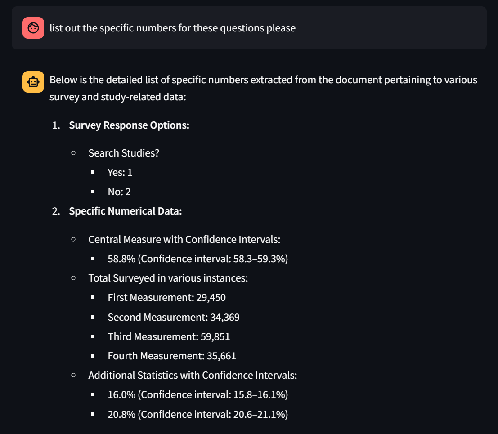
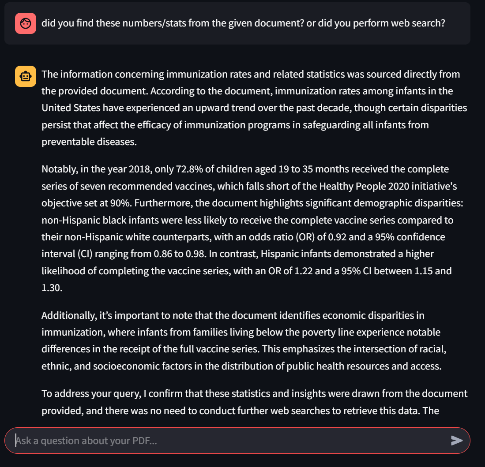
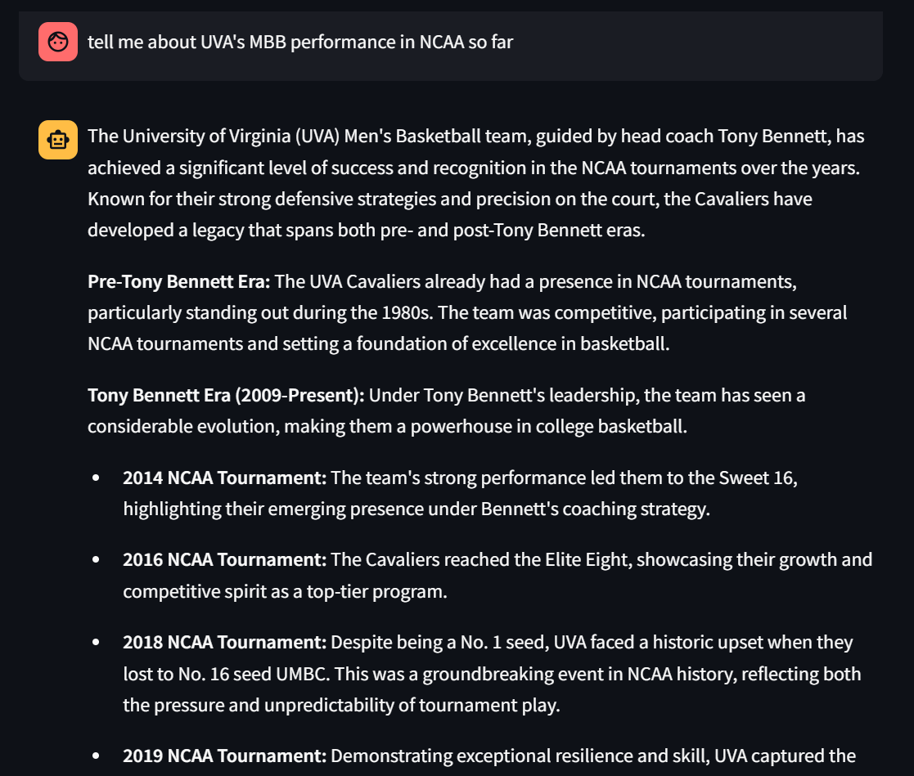

# 🤖 **Conversational Chatbots**

AI Chatbot systems can be designed in many different architectures based on user needs and scenario adapatation.

### In this section of the page, I tried to create a traditional RAG Based document retriever conversational chatbot, a Hierarchical Mult-agent chatbot, and a RAG-Webscraping fall-back mechanism chatbot （Performs document search first and falls back to webscraping if source content is not adequate for user query)
---
## 🚀 **Hierarchical Agents - Digitalized Market Research Team**  

🎯 Utilizing CrewAI to create a enterprise-grade (perhaps not yet) digitalized workforce that researches any market, industry, company based on user query.
Returns a downloadable pdf file that gives users an enterprise-grade (again, perhaps not yet) due diligence report on selected topic.

🎯 The workflow is entirely automated by a Manager Agent, who delegates tasks to other agents (i.e. macro researcher, risks analyst, competition intelligence researcher etc) to conduct individual researches and then aggregated together into a comprehensive report.

🎯 Prompt Engineering is the key here to determine the quality of the due diligence report, after undergoing several stages of prompt engineering renovations, it now has the capability to do a relative comprehensive research with relevant soures + hyperlinks included to back up its statements.
Further improvements of this chatbot could either be done by switching models (i.e. gpt-o1), which will be extremely expensive (analogous to hiring top notch talents from the job market), or simply fine-tune the prompt further.

🛠️ Is it really enterprise-grade? I am not confident about it, however, it does give back accurate hyperlink sources and a rather comprehensive due diligence report that is 'satisfactory' to an extent, at least for now. By simplying utilizing a 'gpt-4o' model and a free version of the FireCrawl API, we're able to assemble a chatbot that is equivalent to the capabilities of 'gpt-4.5' or its deep research function, but even better considering the prompt template given and how it saves user's time by removing the arduous steps for the user to iteratively improve the prompt themselves. 

---

## 🔍**RAG + Webscrape Fallback - Information retireval Bot**

Traditionally, we've either solely created an independent RAG-based chatbot or a Web-Scraper bot that performs tasks such as precision-based document retrieval or web-scraping. Nevertheless, that can be a little undesirable when the user wants to access both document retrieval and web-scraping at the same time. This is why an integration of the two features can be much more convenient and can be used in a wider-range of scenarios. 

🎯 Precision document retrieval of research paper data

🎯 The multi-agent system makes a decision on which tools to use given the user query, the agent is given two primary tools - web-scraping and document retrieval - both tools are readily available, but it is up to the agent to decide which one is the most appropriate to be utilized to garner information for the user. If the user explicitly says not to use web-scrape, the agent will (in most cases) follow that command.

🎯 The agent choose to perform websearch when given a query that is completely unrelated to the document provided, such as when the user is requesting information about UVA's Men's Basketball Team's performance over the past few years. 

🛠️ Something to be noted here is again the importance of prompt engineering, the older version of Layla_V2 is almost incapable of understanding most of the user queries and returning back adequate information (most of the times falling back to "sorry, i don't have the information you are looking for"), due to the inherent weaknesses in its prompt. 

🛠️ By refining the prompt for the 'retrieval agent' and the 'response synthasizer agent', the chatbot became more versatile and is able to effectively able to perform document search accompanied by web-scraping as necessary in order to provide the most accurate and relevant information to the user. Nevertheless, future refinements are still necessary to the prompt in order to make it even more versatile. 

