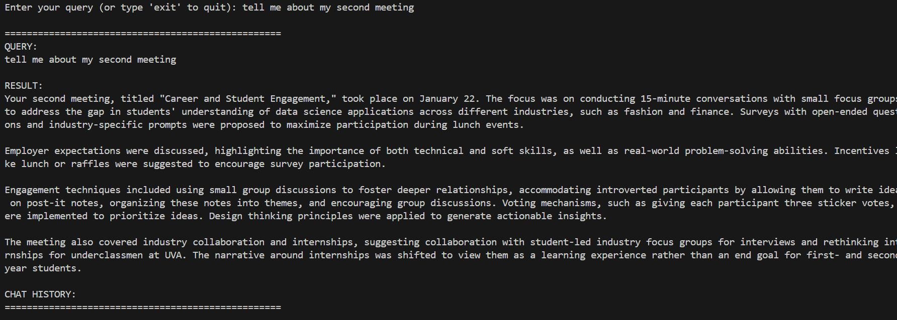

# 🤖 **RAG-Based Chatbot Demo (In Terminal)**

---

## 🚀 **Description of RAG Based Chatbots**  
Utilizing existing LLMs and independent Vector Databases to produce accurate, contextual, and reliable responses. 

RAG stands for Retrieval Augmented Generation, think of it like giving your chatbot a brain full of searchable knowledge. Imagine a chatbot that could tap into a vast library of information and generate creative text. That’s the magic of RAG. -- Quote from Medium   

---

## 🛠 **Features of this Chatbot system**  
- ✅ Feature 1: Accurate responses, tailored to user needs  
- ✅ Feature 2: Context based conversation, does not perform third party web searches or deviates from given topic
- ✅ Feature 3: Does not hallucinate nor produce unreliable answers (to an extent)
- 🛠️ Parameter 1: Temperature (the extent of LLM creativity) of the LLM
- 🛠️ Parameter 2: choice of LLM (OpenAI, Ollama, DeepSeek, etc)
- 🛠️ Parameter 3: choice of Retrieval method - stuff, map_reduce, refine, map_rerank
- 🛠️ Parameter 4: Chunk size - how long each text chunk should be
- 🛠️ Parameter 5: Chunk overlap - how much each text chunk should overlap against each other

---

## **Demo picture: Terminal based interface**
 

---

## **Chaining Methods Explained**

<code style="color : blue">**STUFF CHAIN**</code>: convert documents into smaller chunks, processing each chunk individually, combining summaries to generate a final summary. (method used by this particular project)
- Pros 👍：
  - efficiently handles large documents
  - chunk-wise summarization
- Cons 👎：
  - Depends on how well **chunk size** and **chunk overlap** is tweaked
  - could be slower (depending on condition)

<code style="color : blue">**MAP REDUCE**:</code> summarizing each document individually (map step) and combining summaries into a final summary (reduce step). Dividing documents into chunks, generating summaries for each chunk, combining summaries to create a final summary.
- Pros 👍：
  - effectively handles large documents by dividing texts into manageble chunks
  - reduces processing time by processing chunks individually
  - scalable, could handle documents that exceed token limit of LLMs
- Cons 👎：
  - requires extra step in combining individual summaries, could render response generation time slower
    
 <code style="color : blue">**REFINE**</code>: iteratively updates its answer by looping over the input documents, for each document, it passes non-document inputs, the current document, and the latest intermediate answer to the LLM chain to retrieve a new answer. Alternative to **Map Reduce**, involves generating the summary of the first chunk, combining it with the second, generates another summary, and continue the process until a final summary is achieved.
- Pros 👍：
  - simpler than **Map reduce** method
  - achieves similar results with large documents with less compmlexity
  - could refine existing summaries based on new context 
- Cons 👎：
  - limited functionality compared to other techniques
  - could be slower than other techniques
    
<code style="color : blue">**MAP-RERANK**</code>: divides texts into batches, submits each one to the LLM, returns a score indicating how comprehensively it answers the question, determines final answer based on highest scoring replies from each batch.
- Pros 👍：
  - self-optimization in terms of the quality of response produced
  - automating the optimization process of LLM response generation quality
- Cons 👎：
  - could take up more time/slower response due to the need for scoring and comparison
 
  
